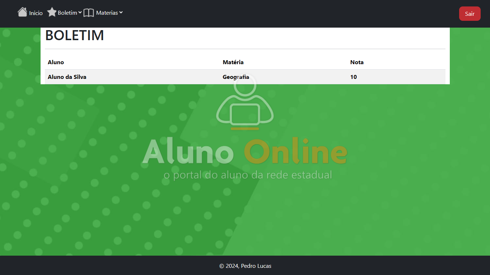
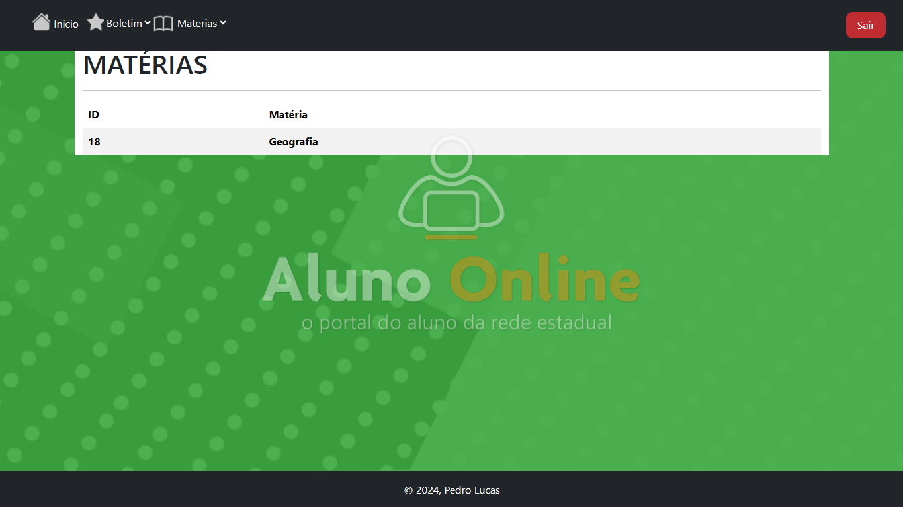
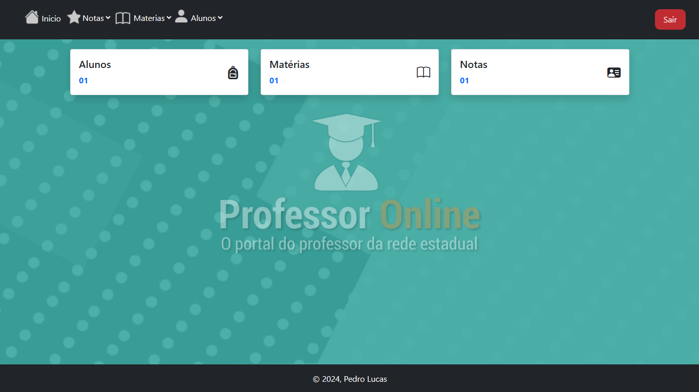
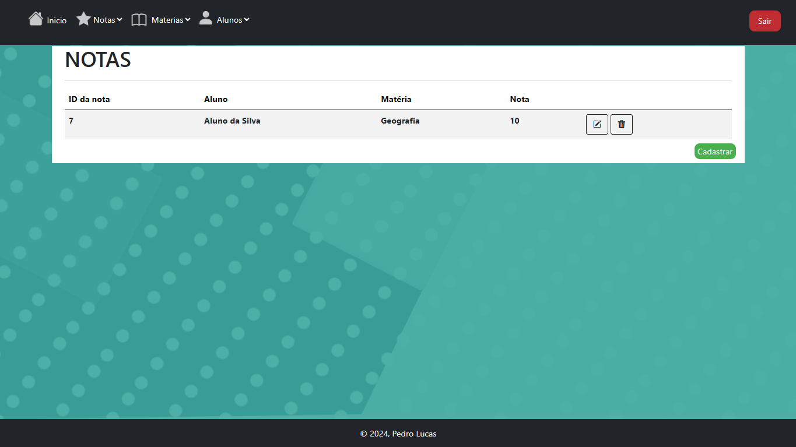

# 🎓 Sistema Acadêmico - Aluno Online

## 📌 Sobre o projeto
Este projeto consiste em um sistema acadêmico com dois níveis de acesso: aluno e professor.

A aplicação permite o gerenciamento de informações escolares, como notas, alunos e disciplinas, além da visualização de boletins individuais.

---

## 🚀 Funcionalidades

### 👨‍🏫 Professor
- Login no sistema
- Cadastro de alunos
- Cadastro de disciplinas
- Lançamento e edição de notas
- Exclusão de registros

### 👨‍🎓 Aluno
- Login no sistema
- Visualização do próprio boletim
- Acompanhamento de notas por disciplina

---

## 🔐 Controle de acesso
O sistema possui diferenciação de permissões:
- Professores têm acesso total ao gerenciamento
- Alunos possuem acesso restrito apenas às próprias informações

---

## 🛠 Tecnologias utilizadas
- HTML
- CSS
- JavaScript
- PHP
- MySQL

---

## 🎯 Objetivo
Projeto desenvolvido com o objetivo de praticar conceitos de:
- Lógica de programação
- Manipulação de dados
- Controle de acesso (autenticação e autorização)
- Estruturação de sistemas

---

## 📷 Demonstração

### 🔐 Tela de Login

### 👨‍🎓 Área do Aluno

### 👨‍🏫 Área do Professor

---

## 📎 Como executar
1. Clone o repositório
2. Abra o projeto em um servidor local (ex: XAMPP)
3. Configure o banco de dados 
4. Execute o sistema no navegador

---

## 👨‍💻 Autor
Pedro Lucas Menezes Sousa
